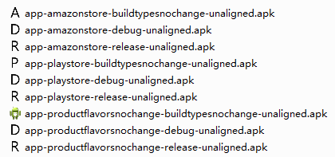
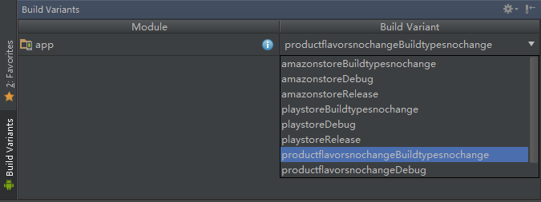

# Gradle Build Variants

本例用于讲解如何使用 `Gradle` 利用一份代码生成多种 APK 。

本例中， `app` 文件夹中，除了默认会生成的 `main` 目录以及 `androidTest` 目录之外，我额外添加了6个目录，分别是： `release` 、 `debug` 、 `buildtypesnochange` 、 `playstore` 、 `amazonstore` 、 `productflavorsnochange` 。同时，我们在 `app/build.gradle` 中将这 6 个文件夹分不到 `buildTypes` 和 `productFlavors` 中。

```
buildTypes {
    release {
        applicationIdSuffix '.release'
        signingConfig signingConfigs.release
        zipAlignEnabled false
    }
    debug {
        applicationIdSuffix '.debug'
        zipAlignEnabled false
    }
    buildtypesnochange {
        signingConfig signingConfigs.release
        zipAlignEnabled false
    }
}

productFlavors {
    playstore {
        applicationId 'cc.bb.aa.gradle_build_variants.playstore'
    }
    amazonstore {
        applicationId 'cc.bb.aa.gradle_build_variants.amazonstore'
    }
    productflavorsnochange {}
}
```

我们通过 `gradle build` 命令，可以生成 9 种不同的 APK ，见下图：



这 9 种 APK 的包名不同，图标不同，应用程序名称不同，首页中显示的内容不同，但是却来自一份代码。

> 设置所有的 `buildTypes` 的 `zipAlignEnabled` 为 `false` 目的是为了只生成 `unaligned` 的 APK ，用于只产生 9 个 APK 。因为 `unaligned` 的 APK 是编译 `aligned` 的 APK的中间产物，会影响我们最终编译出的 APK 的个数。

> 为 `release` 和 `buildtypesnochange` 设置签名是为了方便安装到设备中。

仔细观察额外添加的这 6 个目录的结构，可以发现它们的结构和 `main` 的结构是相同的。但是，它们和 `main` 中的文件还是有一些区别的：
1. 我在对应的目录下放置了名称相同内容却不同的 `ic_launcher.png` 图片。
2. 在 `release` 、 `debug` 、 `playstore` 、 `amazonstore` 中修改了 `strings.xml` 的内容，同时删除了 `action_settings` 字段。
3. 在这 6 个目录中各自创建了对应的类，`release` 、 `debug`、 `buildtypesnochange` 中创建的类类名和方法名均相同，只是返回结果不同； `playstore` 、 `amazonstore` 、 `productflavorsnochange` 中创建的类类名和方法名均相同，只是返回结果不同。
4. 这6个文件夹的 `res` 文件中的文件以及文件夹，相对于 `main/res` 文件夹很多都没有。

观察 Android Studio 中 `Build Variants` 面板，发现 `app` 的选项列表已经不是默认的 `release` 和 `debug` 了。



这些列表是一个 `productFlavors` 和一个 `buildTypes` 组装的结果。


在 Android Studio 的 `Gradle Plugin` 中，每一个 APK 均是由一个 `buildTypes` 和一个 `productFlavors` 组装而成。

在默认的情况下，  `buildTypes` 有 `release` 和 `debug` 两个分支； `productFlavors` 没有。

每一个 `module/src` 都有一个名称为 `main` 的文件夹。这个文件夹属于 `buildTypes` 和 `productFlavors` 基础， `buildTypes` 和 `productFlavors` 都可以访问和修改 `main` 文件夹中的内容。

例如：

`debug` 类型的 APK 的名称为 `Debug`；`release` 类型的 APK 的名称为 `Release`； `buildtypesnochange` 类型的 APK 的名称为 `playstore` 、 `amazonstore` 、 `productflavorsnochange` 中设置的 `apname` 名称（分别对应  `Play` 、 `Amazon` 、 `Gradle-Build-Variants` 。 `buildtypesnochange` 和 `productflavorsnochange` 中没有设置 `appname` ，则使用了 `main` 中的 `appname`）。

`debug` 类型的 APK 的图标为 `D`；`release` 类型的 APK 的图标为 `R`； `buildtypesnochange` 类型的 APK 的图标为 `playstore` 、 `amazonstore` 、 `productflavorsnochange` 中设置的 `apname` 图标（分别对应图标 `P` 、 `A` 、Android 默认图标。 `buildtypesnochange` 和 `productflavorsnochange` 中均没有设置 `ic_launcher.png` ，则使用了 `main` 中的 `ic_launcher.png`）。

在类 `MainActivity` 中，有这么一段代码：

```Java
TextView textView = (TextView) findViewById(R.id.textview);
textView.append("\nappName = " + getString(R.string.app_name));
textView.append("\nBuildTypesName = " + BuildTypesUtils.getBuildTypesName());
textView.append("\nProductFlavorsName = " + ProductFlavorsUtils.getProductFlavorsName());
textView.append("\npackageName = " + getPackageName());
```

实际上，在 `main` 文件夹中，并没有定义 `BuildTypesUtils` 类和 `ProductFlavorsUtils` 类（ `BuildTypesUtils` 类定义在 `release` 、 `debug` 、 `buildtypesnochange` 中； `ProductFlavorsUtils` 类定义在 `playstore` 、 `amazonstore` 、 `productflavorsnochange` 中），但是我们可以使用这些类。

---

当你在 Android Studio 的 `Build Variants` 面板中切换当前选择的 `Build Variants` ，你会发现在 `Project` 面板中，对应的两个文件夹的 `java` 和 `res` 文件夹的图标会发生变化（显示为资源文件夹图标的样式），而 `main` 文件夹中的这两个文件夹一直表现为资源文件夹图标的样式。  
你在 `Build Variants` 面板切换 `Build Variants` ，实际上是在更改当前编译的分支。当你选择了一个 `Build Variants` 后，Android Studio 会编译改 `Build Variants` 对应的 `buildTypes` 和 `productFlavors` 中的类以及资源文件，重新组装，形成新的 App 。所谓的重新组装，简单理解起来就是，将当前的 `Build Variants` 对应的 `buildTypes` 文件夹中的内容、当前的 `Build Variants` 对应的 `productFlavors` 对应的文件夹中的内容、 `main` 文件夹中的内容合并到一起，形成一个并集。

合并规则：

1. 图片、音频、 `XML` 类型的 `Drawable` 等资源文件，将会进行文件级的覆盖（本例中的 `ic_launcher.png`）。
2. 字符串、颜色值、整型等资源以及 `AndroidManifest.xml` ，将会进行元素级的覆盖（本例中的 `appname` 、 `hello_world`）。
3. 代码资源，同一个类， `buildTypes` 、 `productFlavors` 、 `main` 中只能存在一次，否则会有类重复的错误（这就是为什么本例中没有在 `main` 中定义 `BuildTypesUtils` 类和 `ProductFlavorsUtils` 类）。
4. 覆盖等级为：`buildTypes` > `productFlavors` > `main` （这就是为什么 `release` 类型的 APK 的名称都是 `Release` ； `debug` 类型的 APK 的名称都是 `Debug` ； `buildtypesnochange` 类型的 APK 的名称需要根据 `productFlavors` 来确定）。