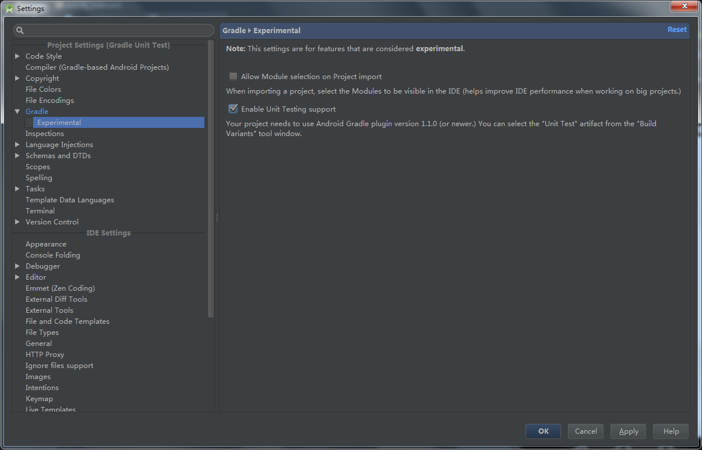
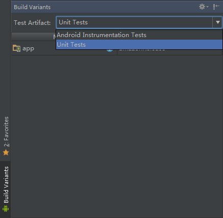
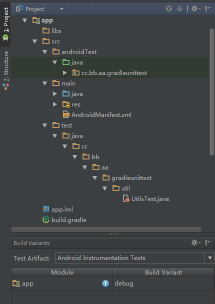
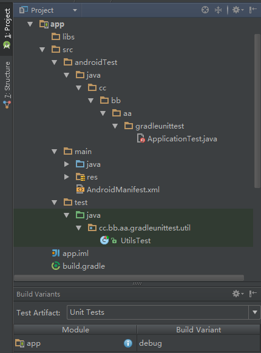
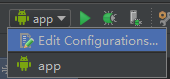
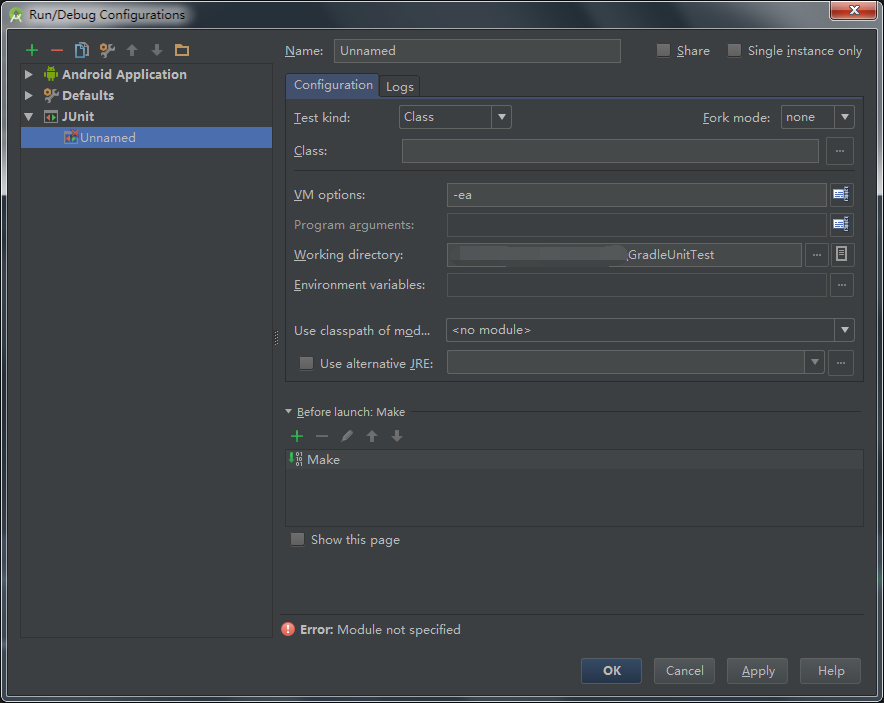
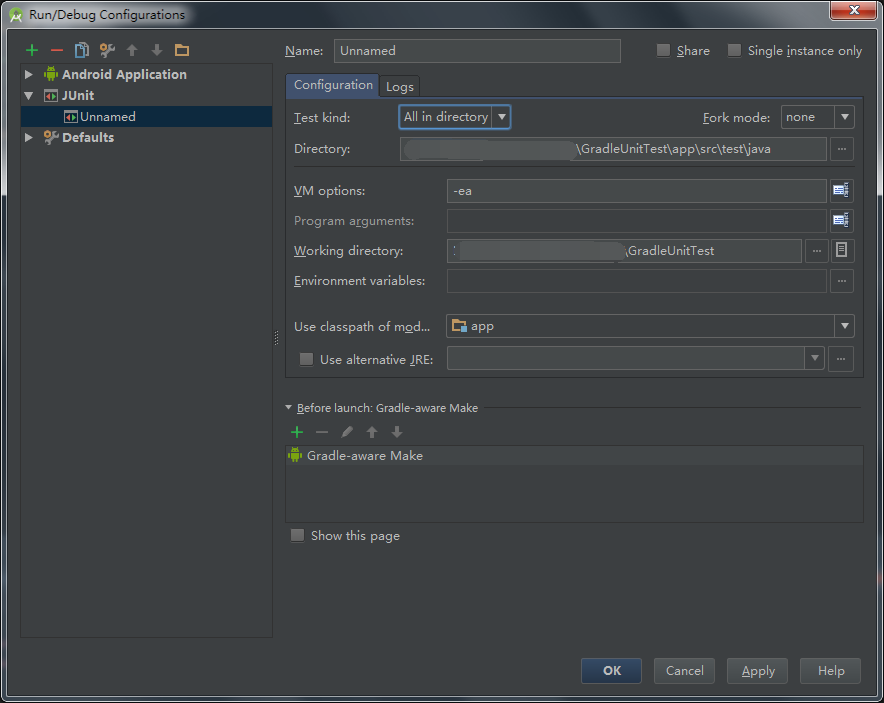
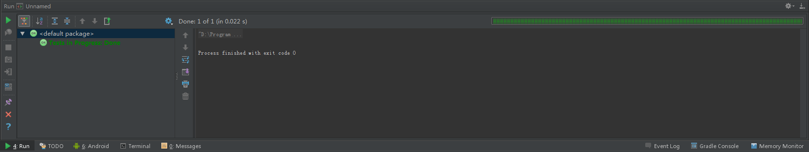
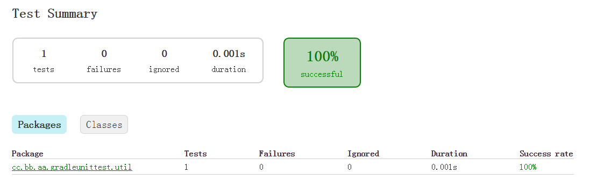

# Gradle Unit Test

Android Studio 1.1 正式版本已经发布， 1.1 版本最大的新功能就是正式支持 Unit 。所谓支持 Unit 是指 Gradle 的 Unit 支持。本文中的内容，也需要在 Android Studio 1.1 中才能正常执行。

文本是对 [Unit testing support](http://tools.android.com/tech-docs/unit-testing-support) 的个人理解和总结。不足的地方，还望指正。

## 环境设置

**讲解1**

在默认情况下，Android Studio 只开启了 `Android Instrumentation Test` ，需要手动开启 `Unit Test` 。

Settings-->Gradle-->Experimental ，勾选 `Enable Unit Testing support` 。



**讲解2**

在 `Build Variants` 面板中，选择 `Unit Tests` 。



**讲解3**

当你在在 `Build Variants` 面板中，选择 `Unit Tests` 时，可能会有如下的提示：


其实，你可能在上一步勾选 `Enable Unit Testing support` 时就已经发现了，Android Studio 已经提示了， `Unit Testing` 需要 `Android Gradle plugin` 1.1 以及以上版本，所以我们需要设置 `{@projectName}/build.gradle` 中的 `Android Gradle plugin` 版本为 1.1 ，如果你的 `Android Gradle plugin` 已经为 1.1 或者以上版本，可以跳过此步。

```
buildscript {
    repositories {
        jcenter()
    }
    dependencies {
        classpath 'com.android.tools.build:gradle:1.1.0'

        // NOTE: Do not place your application dependencies here; they belong
        // in the individual module build.gradle files
    }
}

allprojects {
    repositories {
        jcenter()
    }
}
```

**讲解4**

Java 在做 `Unit Test` 的时候，最常用的便是 `JUnit` 了，所以我们需要加入 `JUnit` 的依赖。在 `{@projectName}/{@moduleName}/build.gradle` 中添加 `JUnit` 的 `Maven` 依赖。

```
dependencies {
    testCompile 'junit:junit:4.12'
}
```

`testCompile` 意思为，test模式下依赖某一个库，该库不会在我们正式发布时打包到我们的程序中，作用和 `debugCompile` 类似。

**讲解5**

在 `{@moduleName}/src` 目录下创建 `test/java` 文件夹。该文件夹是 `Unit Test` 代码存放的位置。

测试代码的包名、类名、方法名均可以自定义，不用和被测试代码相同。但是为了方便自己和他人，建议**使用一一对应的方式建立原代码和测试代码的关系**。

## 编写测试

**讲解6**

Demo `GradleUnitTest` 是一个测试 `Utils` 类中 `add` 方法的项目，借助测试该类我们学习 `Unit Test` 的基本使用。该类的具体文件路径为 `{@projectName}/{@moduleName}/src/main/java/cc/bb/aa/gradleunittest/util/Utils.java` 。

```
public class Utils
{
    public static int add(int a, int b)
    {
        return a + b;
    }
}
```

我们为 `Utils` 类编写一个测试类，类名为 `UtilsTest` ，该类具体的具体文件路径为 `{@projectName}/{@moduleName}/src/test/java/cc/bb/aa/gradleunittest/util/UtilsTest.java` 。

```
public class UtilsTest
{
    @Test
    public void add()
    {
        Assert.assertTrue(3 == Utils.add(1, 2));
    }
}
```

其中 `@Test` 为 `JUnit` 的注解，用于标注测试方法。关于更多 `JUnit` 的知识，请自行搜索学习。

> 我们可以在 `Build Variants` 面板中切换 `Unit Tests` 和 `Android Instrumentation Test` 来观察 `Project` 面板中项目目录的显示情况。

> 勾选 `Android Instrumentation Test` 时：

> 

> 勾选 `Unit Tests` 时：

> 

## 执行测试

### JUnit

**讲解7**

选择 `Edit configurations`



添加一个 `JUnit`



删除 `Before launch` 中的 `Make` ，添加一个 `Gradle-aware make` ，`Task` 可以不用填写，直接点击 `OK` 。

你可以在 `Configuration` 中设置测试过滤。例如，我在 `Test kind` 中选择 `All in directory` ，并且在 `Directory` 中选择了 `{@projectName}/{@moduleName}/src/test/java` 文件夹，这样便可以一次性测试所有的测试代码。

需要在 `Use classpath of module` 中选择需要测试的 `module` 。

最终的设置结果如下：



点击 `OK` ，运行刚刚设置的 `JUnit` ，便可以观察到测试结果。



### Gradle Unit

**讲解8**

我们除了在 `Run/Debug Configurations` 中添加 `JUnit` 之外，还可以在 `Gradle` 面板中执行 `test` 命令。

双击 `Gradle` 面板中执行 `test` 命令，发现该命令除了在 `Message` 和 `Run` 面板中输入大段大段的文字，并没有什么具体的反应。其实，测试的结果放在了一个目录下面。

在 `{@projectName}/{@moduleName}/build/reports/tests` 中我们可以看到 `debug` 和 `release` 两个文件夹，分别对应的是 `debug` 和 `release` 这两个 `BuildTypes` 的测试结果（ `Gradle` 的 `test` 命令实际包含了`testDebug` 和 `testRelease` 两个命令）。在这两个文件夹中，就是各自的测试结果。

例如，在 `debug` 文件夹中，我们打开 `index.html` 就可以查看测试结果了。



执行 `test` 命令时，如果 `testDebug` 出现了断言错误，命令将停止，不再继续 `testRelease` 。如果你想一次性执行所有的测试，即使出现了断言错误也要继续 `testRelease` ，请看 **讲解9** 。

**讲解9**

你也可以在命令行中使用 `Gradle` 命令执行 `Unit Test` 。

例如，**讲解8** 中的 `test` 命令，我们可以在命令行中执行 `./gradlew test` 完成。

执行 `test` 命令时，如果 `testDebug` 出现了断言错误，命令将停止，不再继续 `testRelease` 。如果你想一次性执行所有的测试，即使出现了断言错误也要继续的话，你可以使用 `./gradlew test --continue` 命令。这样，所以的测试结果都会输出到 `{@projectName}/{@moduleName}/build/reports/tests` 目录，包括断言错误的内容。

如果你想单独测试某个类，你可以添加 `--tests` 参数。例如： `./gradlew testDebug --tests='*.MyTestClass'` 。

> 在命令行中使用 `Gradle` 命令是一件很痛苦的事情，因为它会下载项目构建环境依赖（~~因为 GFW ，你还可能下载失败~~）。而这些依赖已经存在 Android Studio 中了。没有使用已经存在的依赖，是因为在命令行中执行 `Gradle` 命令已经脱离了 Android Studio，就是纯粹地使用 `Gradle` （`Android  Studio Gradle plugin` 的作用便在于此）。

## Flavors 和 BuildTypes

本节内容，请参考 `GradleUnitTest2` 中的代码。

**讲解10**

`Gradle` 支持 `Flavors` 和 `BuildTypes` ，因此要有对应的测试。

`Flavors` 和 `BuildTypes` 中的代码需要和对应分支下的测试类有对应的目录关系。 `GradleUnitTest2` 中对应的关系如下：

Production class|Test class
---|---
src/main/java/cc/bb/aa/gradleunittest/util/Utils.java|src/test/java/cc/bb/aa/gradleunittest/util/UtilsTest.java
src/amazon/java/cc/bb/aa/gradleunittest/util/ProductFlavors.java|src/testAmazon/java/cc/bb/aa/gradleunittest/util/ProductFlavorsTest.java
src/google/java/cc/bb/aa/gradleunittest/util/ProductFlavors.java|src/testGoogle/java/cc/bb/aa/gradleunittest/util/ProductFlavorsTest.java
src/debug/java/cc/bb/aa/gradleunittest/util/BuildTypes.java|src/testDebug/java/cc/bb/aa/gradleunittest/util/BuildTypesTest.java
src/release/java/cc/bb/aa/gradleunittest/util/BuildTypes.java|src/testRelease/java/cc/bb/aa/gradleunittest/util/BuildTypesTest.java

因此，`Gradle` 命令不再简简单单只有 `test` 、 `testDebug` 、 `testRelease` 3个，现在为 `test` 、 `testAmazonDebug` 、 `testAmazonRelease` 、 `testGoogleDebug` 、 `testGoogleRelease` 。同样的道理，`test` 命令包含了其他4个命令。

## 其他内容

**讲解11**

`Unit Test` 应该是尽可能独立的。对一个 class 的 `Unit Test` 不应该再和其他 class 有任何交互。

用于运行单元测试的 `android.jar` 文件不包含任何实际的代码(实际的代码由程序所运行在的 Android 真实设备提供)，相反，所有的方法抛出异常（默认情况下）。需要确保您的单元测试只是测试你的代码，不依赖于 Android 平台的任何特定行为。如果你没有使用虚拟依赖生产测试框架（例如： `Mockito` ），你需要在 `{@projectName}/{@moduleName}/build.gradle` 文件中添加以下内容：

```
android {
  // ...
  testOptions { 
    unitTests.returnDefaultValues = true
  }
}
```

例如，我们在测试代码中使用了 `TextUtils.isEmpty` 方法。在测试时，该方法会出现 `java.lang.RuntimeException: Method isEmpty in android.text.TextUtils not mocked.` 异常。当我们设置了 `unitTests.returnDefaultValues = true` ，无论传入的参数是什么，`TextUtils.isEmpty` 方法永远返回 `false` 。